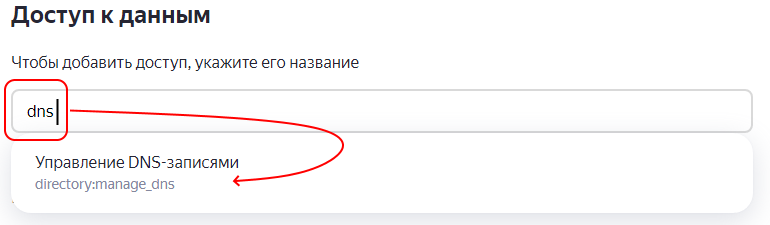

# Certbot wildcard authentificator for Yandex360
PDD Yandex DNS API for certbot `--manual-auth-hook` `--manual-cleanup-hook`

Install and renew Let's encrypt wildcard ssl certificate for wildcard cert using Yandex 360 DNS API:


## 1) Set API KEY

Get your Yandex 360 API key and Organization ID

Documentation is here https://yandex.ru/dev/api360/doc/concepts/intro.html

How to get API key :
    
>* go https://oauth.yandex.ru/client/new (important: without /id in tail)
>* add permissions for change dns
>* set "Callback URI" as https://oauth.yandex.ru/verification_code
>* set your email
>* Create Application
>* then go https://oauth.yandex.ru/authorize?response_type=token&client_id=$CLIENT_ID  
 where $CLIENT_ID is ClientID of your created app from https://oauth.yandex.ru/.  
 Now you have $API_KEY for authentificator.
>* Get get your $ORG_ID from https://admin.yandex.ru/domains/yourdomain.com in bottom-left angle of page.


## 2) Configuring 
```bash
git clone https://github.com/UncleBansh/yandex360-wildcard-issuser && cd ./yandex360-wildcard-issuser
cp ./config.sh.example ./config.sh
#then change API_KEY and ORG_ID variables
```

## 3) Install CertBot


## 4) Generate wildcard
```bash
certbot certonly --manual-public-ip-logging-ok --agree-tos --email info@site.com --renew-by-default -d site.com -d *.site.com --manual --manual-auth-hook $(pwd)/authenticator.sh --manual-cleanup-hook $(pwd)/cleanup.sh --preferred-challenges dns-01 --server https://acme-v02.api.letsencrypt.org/directory
```

## 5) Force Renew
```bash
certbot renew renew --force-renew --manual --manual-auth-hook $(pwd)/authenticator.sh --manual-cleanup-hook $(pwd)/cleanup.sh --preferred-challenges dns-01 --server https://acme-v02.api.letsencrypt.org/directory
```